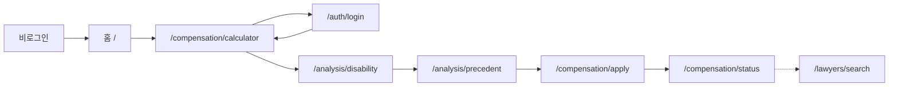
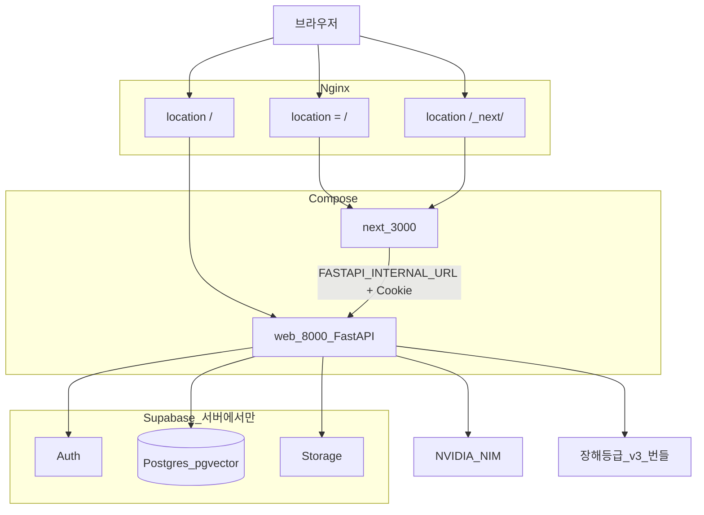
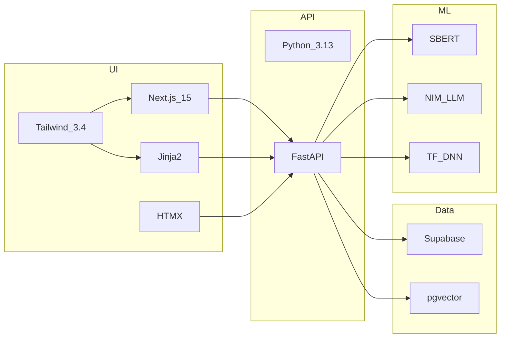

# 산재ON 아키텍처

사람이 보는 이름은 **산재ON**. 코드·이미지·컨테이너 식별자는 당분간 `sanzero`를 쓴다. 관련 문서는 [README.md](README.md), [DESIGN.md](DESIGN.md), [CLAUDE.md](CLAUDE.md).

이 문서는 현재 동작하는 구조를 그린다. 4주 제품화에서 바뀔 예정인 것(계산 스냅샷 테이블, Next 운영 이미지)은 맨 아래 예정 항목으로만 적는다.


## 유스케이스

근로자 한 사람이 신청 전에 거치는 일. 홈 진행 현황과 같은 순서다.

1. 보상금 계산 `/compensation/calculator`
2. 장해등급 예측 `/analysis/disability` — 장해급여 입력을 채우기 위한 단계
3. 유사 판례 `/analysis/precedent`
4. 신청서 `/compensation/apply`
5. 제출 후 심사 배지는 `/compensation/status`



역할별:

| 액터 | 유스케이스 | 진입 |
| --- | --- | --- |
| 근로자 | 가입·로그인, 계산, 장해예측, 판례, 신청, 현황 | `/auth/*`, 위 4단계 |
| 노무사 | 검색 노출, 상담 예약 처리 | `/lawyers/*` |
| 관리자 | 사용자·신청 심사 | `/admin/*` |

홈 SSR JSON `GET /api/home`은 `username`, `user_type`, `claim_progress`만 내린다. 이메일·id·Supabase 키는 브라우저에 두지 않는다.


## 런타임



Next가 꺼지면 FastAPI `GET /` Jinja 대시보드가 `:8000`으로만 폴백한다. Nginx `location = /`는 Next를 가리키므로, 폴백을 보려면 `:8000`으로 직접 연다.


## 화면 경계

| 경로 | 그리는 쪽 | 하는 일 |
| --- | --- | --- |
| `/` | Next.js `web/app/page.tsx` | 히어로, 진행 현황, 산업재해 실황, 기능 챕터 |
| `/_next/*` | Next | 번들 |
| `/compensation/*` | FastAPI Jinja | 계산, 신청, 현황 |
| `/analysis/*` | FastAPI Jinja | 장해등급, 판례 |
| `/lawyers/*` | FastAPI Jinja | 검색, 예약 |
| `/auth/*` | FastAPI Jinja | 로그인, 가입, 프로필 |
| `/admin/*` | FastAPI Jinja | 관리 |
| `/static/*` | FastAPI | 이미지, GLB. Next `public`에 복사하지 않음 |
| `GET /api/home` | FastAPI JSON | 홈 SSR 페이로드 |
| `GET /health` | FastAPI | 헬스 |


## 기술 스택



- UI 토큰·카피는 [DESIGN.md](DESIGN.md). 히어로 시그니처는 2D 방패 프레임 하나.
- 모션: CSS `sz-enter`, Framer Motion. `prefers-reduced-motion`이면 정지.
- 보안: CSRF Double Submit Cookie, bleach XSS, CSP 등 보안 헤더. 브라우저에 Supabase JS 없음.
- 배포: `docker-compose.yml`의 nginx + next + web. 현재 next CMD는 `npm run dev`(제품화 1주차에 prod 이미지로 분리 예정).


## 디렉터리

```
WORKIT/
├── app/                    FastAPI
│   ├── main.py             GET /, GET /api/home, /health
│   ├── routers/            auth, compensation, analysis, lawyers, admin
│   ├── services/           계산, 판례 RAG, 장해등급, claim_progress
│   ├── templates/          Jinja 실무 화면
│   └── static/
├── web/                    Next 홈
│   ├── app/page.tsx
│   └── components/home/
├── nginx.conf
├── docker-compose.yml
└── wireframes/
```


## 데이터

- **users**: 프로필 (`user_type`: general / lawyer / admin)
- **lawyers**: 면허, 전문분야
- **compensation_applications**: 신청·심사 상태
- **consultations**: 상담 예약
- **precedents**: `embedding vector(384)`, RPC 유사도 `1 - (embedding <=> query)`
- **analysis_requests**: 판례 검색, 장해등급 예측 이력
- **notifications**: 알림

```
auth.users
├── users
├── lawyers
├── compensation_applications
├── consultations
└── analysis_requests
```

계산 결과 전용 테이블은 `claim_drafts`(사용자당 최신 JSON 1건). `get_claim_progress_for_user`가 이 스냅샷으로 `has_calculation`을 켠다. 홈은 sessionStorage로 진행 점을 덮지 않는다. 테이블 SQL은 `scripts/add_claim_drafts.sql`.


## 보안 메모

- XSS: bleach. CSRF: Double Submit Cookie. 로그인 CSRF 검증은 `auth.py`에 주석 처리되어 있음(1주차에 다시 켠다).
- 홈 JSON은 공개 프로필만.
- `.env`의 키는 커밋하지 않는다.


## 예정 (제품화 일정)

- **홈 `/`를 Next.js/TS → Nuxt 3(Vue 3, JS)로 1:1 이식.** Nginx `location /_nuxt/`. FastAPI `GET /api/home`·Jinja 폴백은 유지. Vite SPA는 쓰지 않음
