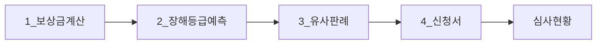
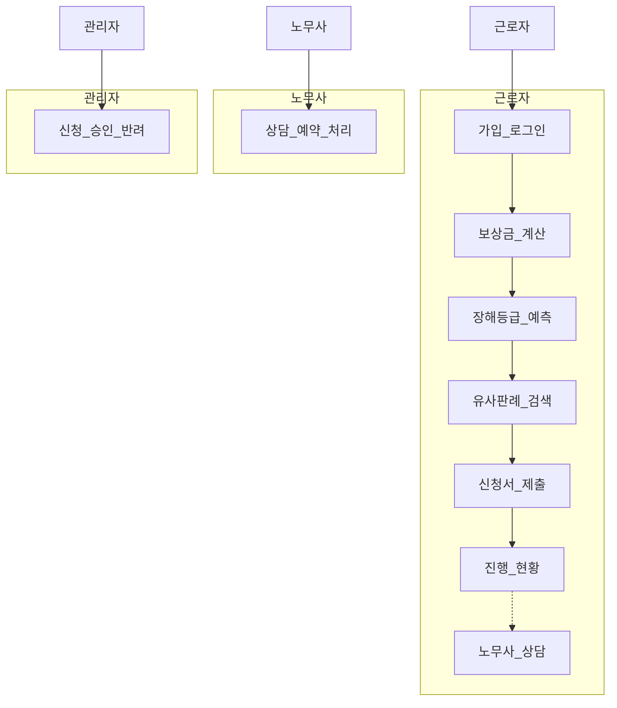
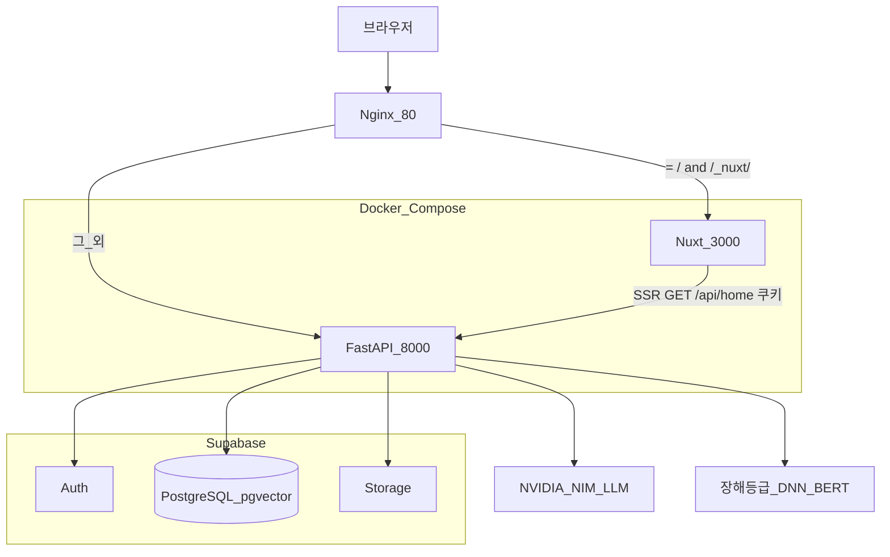
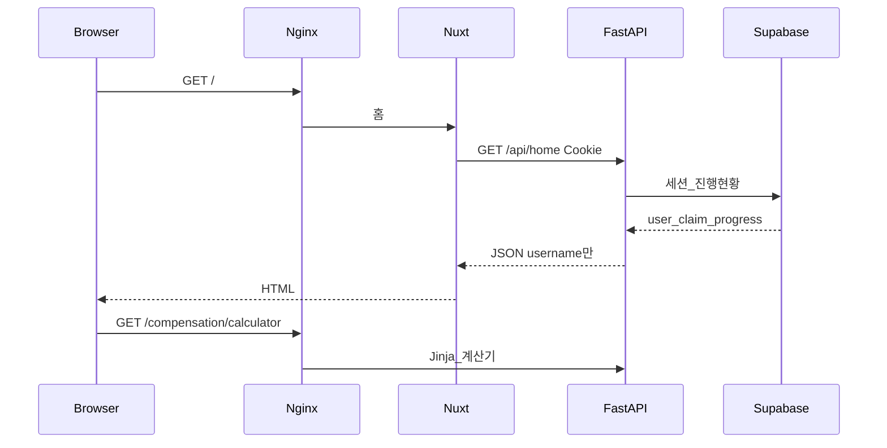
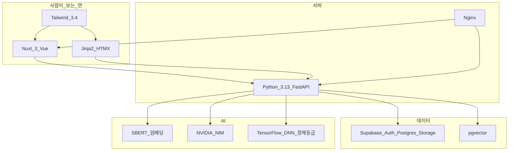

# 산재ON

산업재해 보상, 신청 전에 금액부터 확인하고 등급·판례·신청서까지 한 흐름으로 이어 가는 웹 서비스입니다.

근로자가 산재 제도를 혼자 맞춰 보지 않아도 되게, 계산 → 장해등급 예측 → 유사 판례 → 신청을 서버가 이어서 기억합니다. 이 저장소는 오픈소스 커뮤니티가 아니라 **캡스톤 포트폴리오용 제품 레포**입니다. 외부 기여는 받지 않습니다.

코드·컨테이너 식별자(`sanzero`, `sanzero-*`)는 당분간 유지하고, 사람이 보는 서비스명만 **산재ON**입니다.


## 누가 무엇을 하는가

| 역할 | 하는 일 |
| --- | --- |
| 근로자 | 보상금 계산, 장해등급 예측, 유사 판례 확인, 신청서 제출, 진행 현황 확인. 막히면 노무사 상담 |
| 노무사 | 프로필·상담 요청 확인, 예약 처리 |
| 관리자 | 사용자·신청 심사, 시스템 모니터링 |

핵심 유스케이스는 근로자의 **신청 전 네 단계**입니다. 번호는 마케팅용이 아니라 실제로 건너뛰지 못하는 순서입니다.






## 아키텍처

브라우저는 Nginx 한 곳만 봅니다. 홈(`/`)만 Nuxt가 그리고, 계산·예측·판례·신청·로그인은 FastAPI가 Jinja로 그립니다. 인증·DB·파일은 Supabase를 **서버에서만** 호출합니다. 브라우저에 Supabase SDK·키는 없습니다.



요청이 어디로 가는지:




## 기술 스택



- **프론트**: 홈만 Nuxt 3(`web/`, Vue 3, JavaScript). 실무 화면은 Jinja2 + HTMX. 토큰은 DESIGN.md와 동일. 모션은 `sz-enter` + IntersectionObserver, `prefers-reduced-motion` 필수.
- **백엔드**: Python 3.13, FastAPI, uvicorn.
- **데이터**: Supabase Auth · PostgreSQL · Storage · pgvector. FastAPI만 호출.
- **AI**: 판례 RAG(SBERT + pgvector + NVIDIA NIM), 장해등급 v3(정확 문구 → BERT 유사도 → DNN).
- **인프라**: Docker Compose, Nginx 리버스 프록시·Rate Limit.

상세 라우트·테이블은 [ARCHITECTURE.md](ARCHITECTURE.md)를 봅니다.


## 로컬에서 다시 켜기

제품 소개가 아니라 개발자용입니다.

Docker와 Docker Compose가 필요합니다.

```bash
cp .env.example .env
docker compose up --build -d
```

- 서비스: [http://localhost](http://localhost)
- FastAPI 직접(Jinja 홈 폴백): [http://localhost:8000](http://localhost:8000)
- Next 직접: [http://localhost:3000](http://localhost:3000)

헬스 체크: `GET /health`


## Team

SKALA / AI 융합 캡스톤 디자인. 김형주 — 기획 및 구현.


## License

캡스톤·포트폴리오 목적의 비공개 제품입니다. 코드가 GitHub에 보여도 OSS 라이선스가 아니며, 외부 기여·재배포를 받지 않습니다. [LICENSE](LICENSE)를 봅니다.
