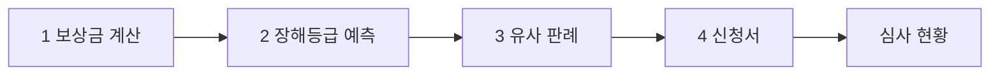
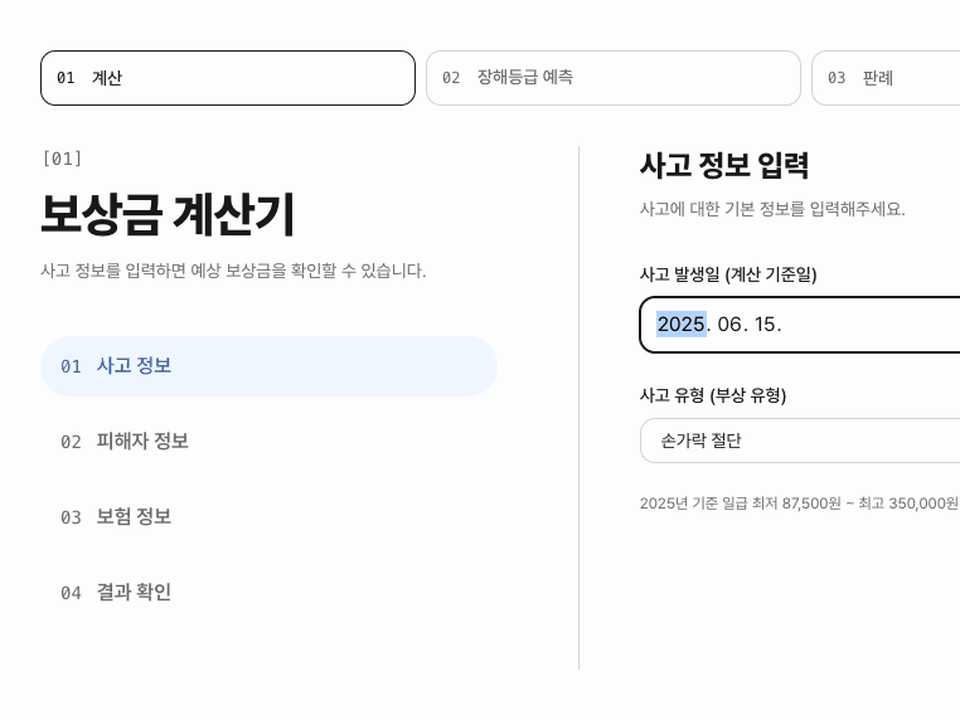
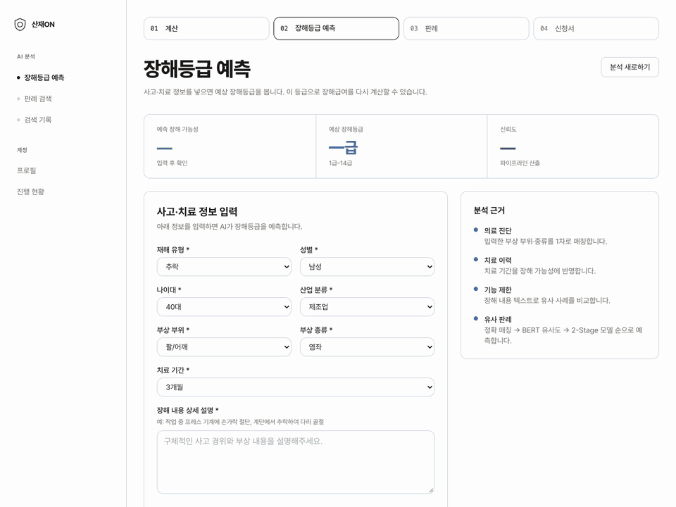
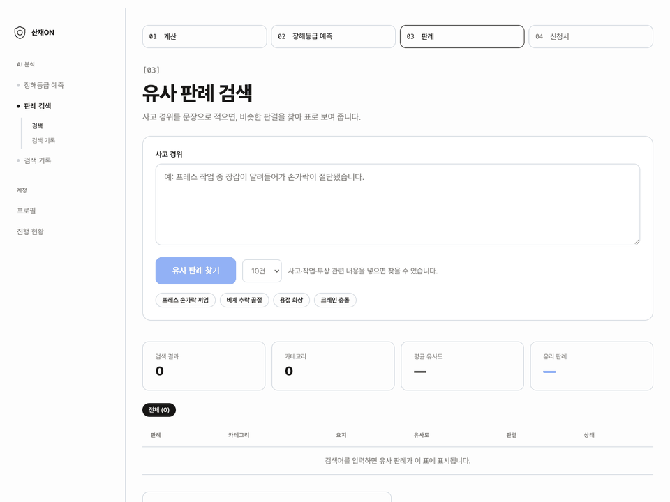
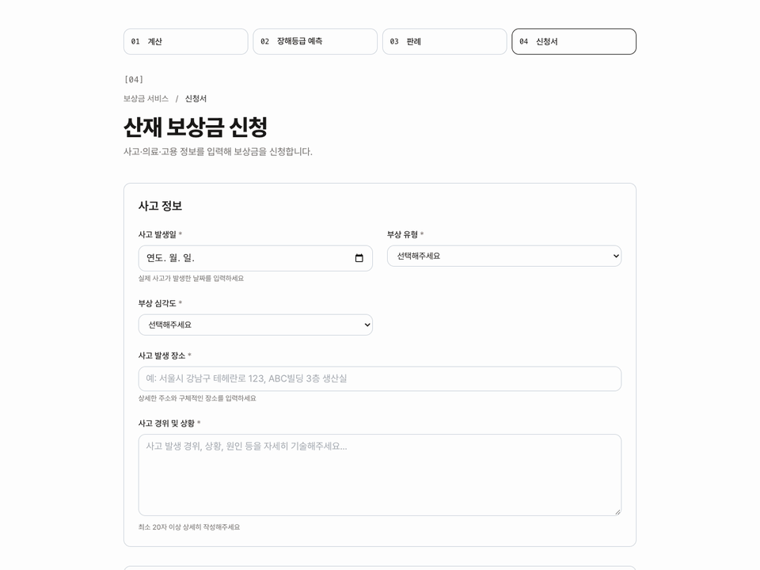
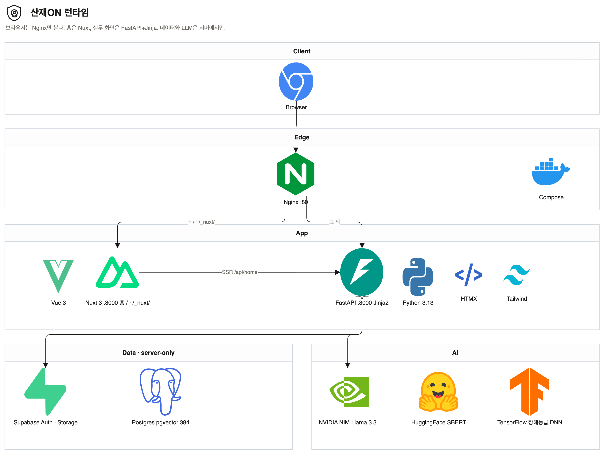

<p align="center">
  
</p>

<h1 align="center">산재ON</h1>

<p align="center">
  <strong>정당한 보상, 처음부터.</strong>
</p>

<p align="center">
  산업재해 보상, 신청 전에 금액부터 확인하고<br />
  장해등급 · 판례 · 신청서까지 한 흐름으로 이어 가는 웹 서비스
</p>

<p align="center">
  <a href="https://nuxt.com/"></a>
  <a href="https://vuejs.org/"></a>
  <a href="https://fastapi.tiangolo.com/"></a>
  <a href="https://www.python.org/"></a>
  <a href="https://tailwindcss.com/"></a>
  <a href="https://supabase.com/"></a>
  <a href="https://www.docker.com/"></a>
</p>


<!-- 배포·발표 링크가 생기면 아래를 채운다.
<p align="center">
  <a href="DEPLOY_URL">배포</a> · <a href="SLIDE_URL">발표 자료</a>
</p>
-->


## 프로젝트 소개

산재ON은 근로자가 산재 제도를 혼자 맞춰 보지 않아도 되게 만든 서비스입니다. 사고 내용과 평균임금을 넣으면 예상 보상금이 나오고, 장해등급을 몰라도 예측 결과로 장해급여를 채운 뒤, 비슷한 판례를 보고 신청서까지 이어서 작성합니다.

고용노동부 2024년 집계 기준 산업재해 재해자는 142,771명, 산재보험 수급자는 405,539명입니다. 급여는 휴업·장해·유족처럼 나뉘어 있고, 장해등급을 모르면 장해급여를 넣을 수 없습니다. 비슷한 사건이 어떻게 끝났는지도 찾기 어렵습니다. 계산·분석·신청이 화면마다 끊기면 어디까지 했는지조차 잊힙니다.

이 사이를 서버가 이어서 기억합니다. 홈에서 진행 점을 브라우저에 심지 않고, 계산 초안·분석 이력·신청서로 그립니다.

| 문제 | 해결 |
| --- | --- |
| 보상 종류와 산식이 흩어져 있어 받을 금액을 가늠하기 어렵다 | 사고 정보와 평균임금으로 휴업·장해·유족급여를 한 화면에서 계산한다 |
| 장해등급을 모르면 장해급여를 넣을 수 없다 | 장해 내용으로 등급을 예측하고, 그 값으로 다시 계산한다 |
| 비슷한 사건이 어떻게 끝났는지 찾기 어렵다 | 사고 경위로 유사 판례를 찾고, 근로자 기준으로 유리·불리·애매를 표시한다 |
| 계산·분석·신청이 따로 떨어져 어디까지 했는지 잊힌다 | 서버가 초안과 이력을 기억하고, 한 줄 타임라인으로 잇는다 |

사람이 보는 이름은 **산재ON**입니다. 코드·컨테이너 식별자(`sanzero`)는 당분간 그대로 둡니다.


## 핵심 기능

근로자가 신청 전에 거치는 순서입니다. 번호는 마케팅용이 아니라 실제로 건너뛰지 않는 단계입니다.



| 역할 | 하는 일 |
| --- | --- |
| 근로자 | 계산, 장해등급 예측, 유사 판례, 신청서, 진행 현황. 막히면 노무사 상담 |
| 노무사 | 프로필·상담 요청 확인, 예약 처리 |
| 관리자 | 사용자·신청 심사 |

### 1. 보상금 계산



사고 발생일·부상 유형·평균임금을 입력하면 휴업급여(평균임금의 70%), 장해급여, 사망이면 유족급여까지 예상액이 나옵니다. 장해등급을 아직 몰라도 됩니다. 계산 결과는 `claim_drafts`에 사용자당 최신 1건으로 남고, 다음 단계 CTA는 장해등급 예측입니다.

### 2. 장해등급 예측



장해 내용을 넣으면 예상 등급과 가능성을 보여 줍니다. 이 단계는 장해급여 입력(`disability_grade`)을 채우려고 있습니다.

예측은 세 단입니다.

1. 장해등급표와 **정확 문구**가 같으면 그 등급
2. 아니면 **BERT 유사도**로 가까운 문구
3. 그래도 부족하면 **Stage-2 DNN**

결과 화면의 주 버튼은 유사 판례, 보조는 이 등급으로 다시 계산입니다.

### 3. 유사 판례



사고 경위를 문장으로 적으면 비슷한 판결을 표로 보여 줍니다. 검색은 SBERT 임베딩과 Supabase pgvector(`vector(384)`)로 하고, 유사도는 `1 - (embedding <=> query)`입니다. 화면의 관련도는 그 값×100입니다.

한 사건의 결론은 **판결**, 검색 대상은 **판례**입니다. 라벨은 `유리 O` / `불리 X` / `애매 △`입니다. 유리도는 유리 O 건수 ÷ 검색 건수입니다. 로그인 검색은 `analysis_requests`에 남겨 `/analysis/history`에서 다시 볼 수 있습니다.

### 4. 신청서와 진행 현황



계산한 내용으로 신청서를 작성하고, 접수·심사·승인 상태는 `/compensation/status`에서 봅니다. 홈 진행 현황 제목은 「내 보상금, 지금 어디까지 왔나요」이고, 점은 서버가 계산합니다. 신청 접수·지급 완료 같은 가짜 날짜를 홈에 넣지 않습니다.

혼자 판단하기 어려운 내용은 푸터 「전문가 상담」으로 노무사를 찾습니다. 노무사는 최후 수단이라 헤더·히어로에는 두지 않습니다.


## 기술적으로 신경 쓴 부분

캡스톤에서 화면을 붙이다가 실제로 막혔던 지점입니다.

### 홈만 Nuxt, 계산·분석·신청은 Jinja

브라우저는 Nginx `:80`만 봅니다. `GET /`과 `/_nuxt/`는 Nuxt 3(`web/`, Vue 3, JavaScript), 나머지는 FastAPI가 Jinja2 + HTMX로 그립니다. Nuxt SSR은 브라우저 쿠키를 그대로 실어 `GET /api/home`을 치고, JSON에는 `username` · `user_type` · `claim_progress`만 내립니다. 이메일·id·Supabase 키는 브라우저에 두지 않습니다. Nuxt가 꺼져 있으면 `:8000`의 Jinja 대시보드가 폴백입니다.

### 진행 현황은 sessionStorage로 칠하지 않는다

홈에서 점을 로컬에 저장하면 기기마다 어긋납니다. `claim_drafts`(계산 스냅샷) + 분석 이력 + 신청서로 서버가 현재 단계를 계산합니다. 테이블이 없어도 계산 결과는 내려가고, 저장만 실패합니다.

### 장해등급은 한 모델이 아니라 세 단

정확 문구 → BERT 유사도 → DNN 순으로 떨어집니다. 문구 매칭 번들은 `scripts/build_integrated_bundle.py` → `app/sanzero_integrated_bundle.joblib`입니다. 장해등급은 독립 상품이 아니라 계산기의 장해급여를 채우는 2단계입니다.

### 한국어 판례 RAG의 임계값

MiniLM 한국어 코사인은 0.7이면 거의 안 나옵니다. 기본 임계는 0.25, 화면은 0.2입니다. 해시 fallback 임베딩을 pgvector에 넣으면 관련도가 0%처럼 보입니다. LLM 분석은 NVIDIA NIM(`meta/llama-3.3-70b-instruct`)입니다.

### 대기 링은 완료 전에 100%를 보여 주지 않는다

장해 예측과 판례 검색은 수 초가 걸립니다. `SanzeroWaitRing`은 지수 곡선으로 체감 진행률을 올리되 94%에서 멈추고, 실제 응답이 온 뒤에야 100%로 붙입니다. `prefers-reduced-motion`이면 애니메이션을 끄고 본문은 숨기지 않습니다.

### 브라우저에 인증 SDK를 두지 않는다

Auth·Postgres·Storage·pgvector는 FastAPI만 호출합니다. CSRF는 Double Submit Cookie라서 폼 hidden 값이 쿠키와 같아야 합니다. 새로 난수를 만들면 403입니다.


## 아키텍처

<p align="center">
  
</p>

브라우저는 Nginx `:80`만 봅니다. `GET /`과 `/_nuxt/`는 Nuxt 3, 나머지는 FastAPI가 Jinja로 그립니다. Auth·Postgres·Storage와 LLM은 서버에서만 호출합니다. 편집용 원본은 [docs/readme/architecture.drawio](docs/readme/architecture.drawio)입니다.

| 경로 | 그리는 쪽 |
| --- | --- |
| `/` | Nuxt 홈. 히어로, 진행 현황, 산업재해 실황, 기능 챕터 |
| `/compensation/*` `/analysis/*` `/lawyers/*` `/auth/*` | FastAPI + Jinja |
| `/static/*` | FastAPI. Nuxt `public`에 복사하지 않음 |
| `GET /api/home` | FastAPI JSON |


## 기술 스택

<p align="center">
  
  &nbsp;
  
  &nbsp;
  
  &nbsp;
  
  &nbsp;
  
  &nbsp;
  
  &nbsp;
  
  &nbsp;
  
  &nbsp;
  
  &nbsp;
  
  &nbsp;
  
  &nbsp;
  
  &nbsp;
  
</p>

**화면**
`Nuxt 3` · `Vue 3` · `Jinja2` · `HTMX` · `Tailwind CSS 3.4`

**서버**
`Python 3.13` · `FastAPI` · `Nginx`

**데이터**
`Supabase Auth` · `PostgreSQL` · `Storage` · `pgvector`

**AI**
`SBERT` · `NVIDIA NIM` · `TensorFlow DNN` (장해등급 v3)

**인프라**
`Docker Compose`


## 폴더 구조

```
WORKIT/
├── app/                    FastAPI
│   ├── main.py             GET /, /api/home, /health
│   ├── routers/            auth, compensation, analysis, lawyers
│   ├── services/           계산, 판례 RAG, 장해등급, claim_progress
│   ├── templates/          Jinja 실무 화면
│   └── static/             이미지, GLB, wait-ring.js
├── web/                    Nuxt 홈
│   ├── pages/index.vue
│   └── components/home/    Hero, ClaimProgress, IndustryReality, FeatureChapters
├── nginx.conf
├── docker-compose.yml
├── scripts/                번들, 임베딩, 시드, 홈 캡처
└── wireframes/             화면 XML
```

라우트·테이블·API 상세는 [ARCHITECTURE.md](ARCHITECTURE.md)를 봅니다. 화면 토큰·카피는 [DESIGN.md](DESIGN.md)입니다.


## Getting Started

Docker와 Docker Compose가 필요합니다. `.env`의 키는 커밋하지 않습니다.

```bash
cp .env.example .env
docker compose up --build -d
```

- 서비스: [http://localhost](http://localhost)
- FastAPI 직접(Jinja 홈 폴백): [http://localhost:8000](http://localhost:8000)
- Nuxt 직접: [http://localhost:3000](http://localhost:3000)

헬스 체크: `GET /health`


## Team

SKALA / AI 융합 캡스톤 디자인

| 기획 · 구현 |
| :---------: |
| 김형주 |

**김형주** — 서비스 기획, 하이브리드 프론트(Nuxt 홈 + Jinja 실무), FastAPI, 판례 RAG, 장해등급 파이프라인 연동


## License

캡스톤·포트폴리오 목적의 제품입니다. 코드가 GitHub에 보여도 OSS 라이선스가 아니며, 외부 기여·재배포를 받지 않습니다. [LICENSE](LICENSE)를 봅니다.
